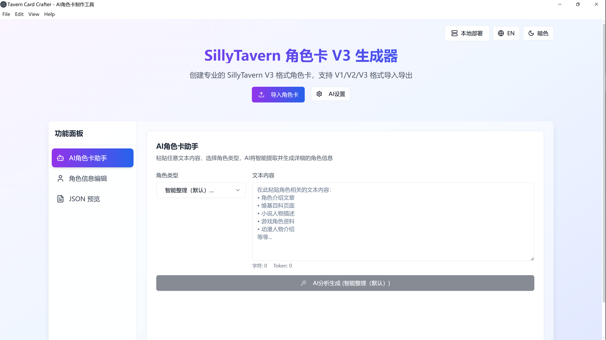
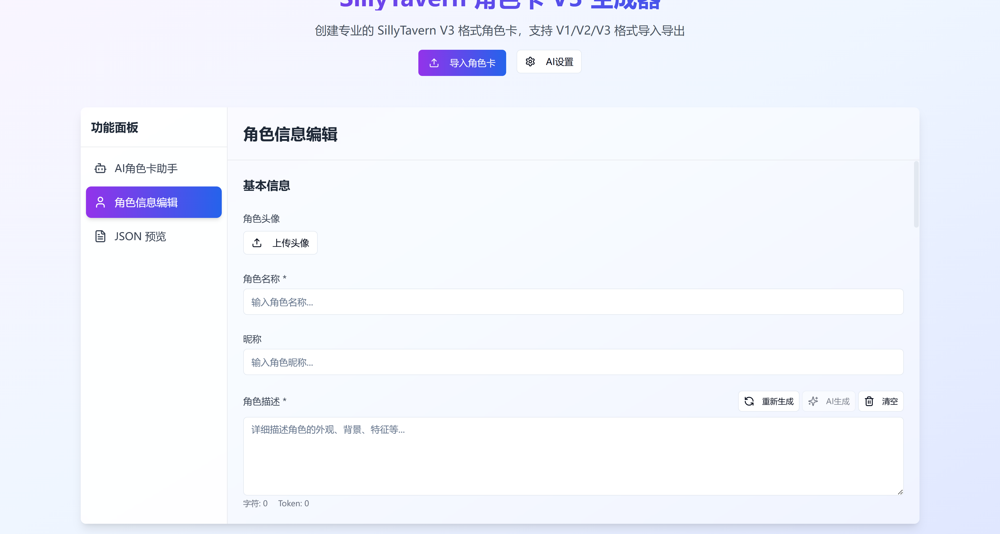
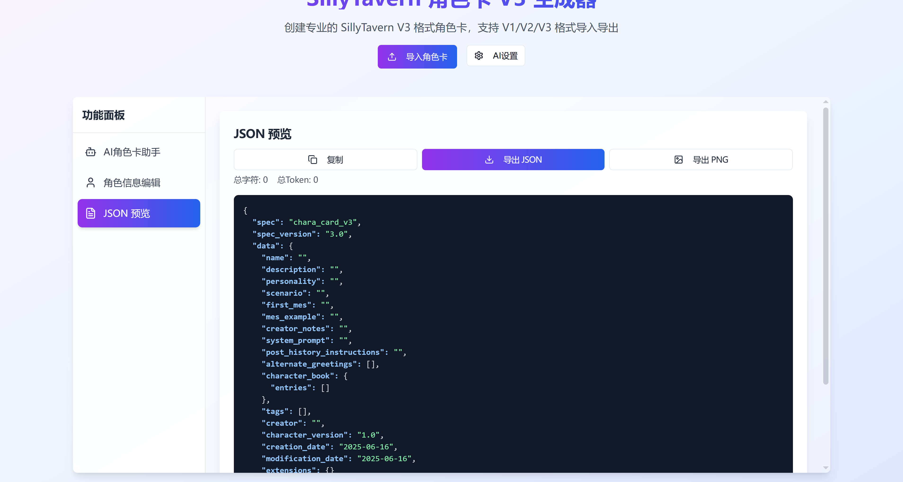

# Tavern Card Crafter - AI角色卡制作工具

## 项目简介

Tavern Card Crafter 是一个专业的AI角色卡片制作工具，帮助用户轻松创建和编辑用于聊天机器人和角色扮演的角色卡片。该工具提供直观的界面和强大的功能，让角色创作变得简单高效。

## 主要功能

### 🤖 AI智能助手
- **智能角色创建**: 通过AI助手快速生成角色基础信息
- **多类型支持**: 支持动漫、游戏、小说、历史人物等不同类型角色
- **智能内容提取**: 粘贴任意文本，AI自动提取并生成结构化角色信息

### ✏️ 完整角色编辑
- **基本信息**: 姓名、描述、第一人称视角等
- **个性特征**: 详细的性格特征和行为模式
- **场景设定**: 背景故事和环境描述
- **对话系统**: 示例对话、问候语、替代问候语
- **角色书**: 世界观设定和记忆条目
- **标签分类**: 角色标签和元数据管理


---

### 📱 多平台支持
- **Web版本**: 浏览器直接访问使用
- **桌面应用**: 跨平台Electron桌面应用
- **侧边栏布局**: AI助手、角色编辑、JSON预览分离式选项卡界面

### 🔧 实用功能
- **实时预览**: JSON格式实时预览，语法高亮显示
- **多格式导出**: 支持JSON和PNG格式导出
- **本地化界面**: 完全中文界面，操作简单直观
- **响应式设计**: 支持各种设备和屏幕尺寸
---


## 技术栈

本项目基于现代Web技术构建：

- **React** - 用户界面框架
- **TypeScript** - 类型安全的JavaScript
- **Vite** - 快速的构建工具
- **Electron** - 跨平台桌面应用框架
- **Tailwind CSS** - 实用优先的CSS框架
- **shadcn/ui** - 高质量的React组件库

## 快速开始

### 环境要求

确保您的系统已安装：
- Node.js (推荐使用 [nvm](https://github.com/nvm-sh/nvm#installing-and-updating) 安装)
- npm 包管理器

### 安装和运行

```bash
# 1. 克隆项目
git clone <YOUR_GIT_URL>

# 2. 进入项目目录
cd tavern-card-crafter-v3

# 3. 安装依赖
npm install

# 4. 启动开发服务器（Web版本）
npm run dev

# 或启动桌面应用开发模式
npm run electron-dev
```

- **Web版本**：在浏览器中访问 `http://localhost:8080`
- **桌面版本**：自动打开 Electron 桌面应用窗口

### 构建和运行

#### Web 版本
```bash
# 构建 Web 版本
npm run build

# 预览构建结果
npm run preview
```

#### 桌面应用版本
```bash
# 快速运行桌面应用（生产模式）
npm run electron

# 构建并运行桌面应用
npm run electron-pack

# 构建桌面应用安装包
npm run electron-build
```

## 使用指南

### 🚀 快速开始
1. **启动应用**: 使用 `npm run electron-dev`（开发）或 `npm run electron`（生产）
2. **选择工作模式**: 使用左侧选项卡在三个功能间切换

### 📋 功能详解

#### 🤖 AI角色卡助手
1. **粘贴内容**: 将角色相关的任意文本粘贴到输入框
2. **选择类型**: 选择角色类型（动漫、游戏、小说、历史人物等）
3. **AI生成**: 点击"AI分析生成"，AI将智能提取并生成结构化信息
4. **一键填入**: 选择生成的字段，一键填入到角色编辑器

#### ✏️ 角色信息编辑
1. **基本信息**: 填写角色姓名、描述、头像等基础信息
2. **个性设定**: 详细描述角色的性格特征和行为模式
3. **对话系统**: 编写首条消息、对话示例和替代问候语
4. **世界观设定**: 添加角色书条目，丰富背景设定
5. **标签管理**: 为角色添加相关标签便于分类

#### 📄 JSON 预览
1. **实时预览**: 查看生成的JSON格式角色卡
2. **语法高亮**: 彩色显示JSON结构，便于阅读
3. **统计信息**: 显示总字符数和Token数量
4. **导出功能**:
   - **JSON导出**: 标准JSON格式文件
   - **PNG导出**: 将角色卡嵌入图片中（需上传头像）
   - **复制到剪贴板**: 快速复制JSON内容

### 💡 使用技巧
- **AI助手**: 可以粘贴角色介绍、小说片段、游戏资料等任意相关文本
- **分步编辑**: 使用选项卡分别专注于AI生成、手动编辑和预览导出
- **实时同步**: 三个选项卡的数据实时同步，随时切换查看效果

## 项目结构

```
src/
├── components/          # React组件
│   ├── CharacterForm/   # 角色编辑表单组件
│   │   ├── AIAssistant.tsx      # AI角色卡助手
│   │   ├── BasicInfoSection.tsx # 基本信息编辑
│   │   ├── PersonalitySection.tsx # 个性特征编辑
│   │   └── ...
│   ├── CharacterPreview.tsx     # JSON预览组件
│   ├── AISettings.tsx           # AI设置组件
│   ├── ui/             # 基础UI组件（shadcn/ui）
│   └── ...
├── pages/              # 页面组件
│   └── Index.tsx       # 主页面（侧边栏选项卡布局）
├── contexts/           # React上下文
│   ├── LanguageContext.tsx     # 多语言支持
│   └── ThemeContext.tsx        # 主题切换
├── hooks/              # 自定义Hook
├── utils/              # 工具函数
│   └── aiGenerator.ts  # AI生成相关工具
├── lib/                # 库文件
└── electron/           # Electron主进程文件
    ├── main.cjs        # 主进程入口
    └── preload.js      # 预加载脚本
```

## 贡献指南

欢迎提交Issue和Pull Request来帮助改进项目！

## 许可证

本项目采用MIT许可证。详情请查看LICENSE文件。

---

*让AI角色创作变得更简单、更高效！*
