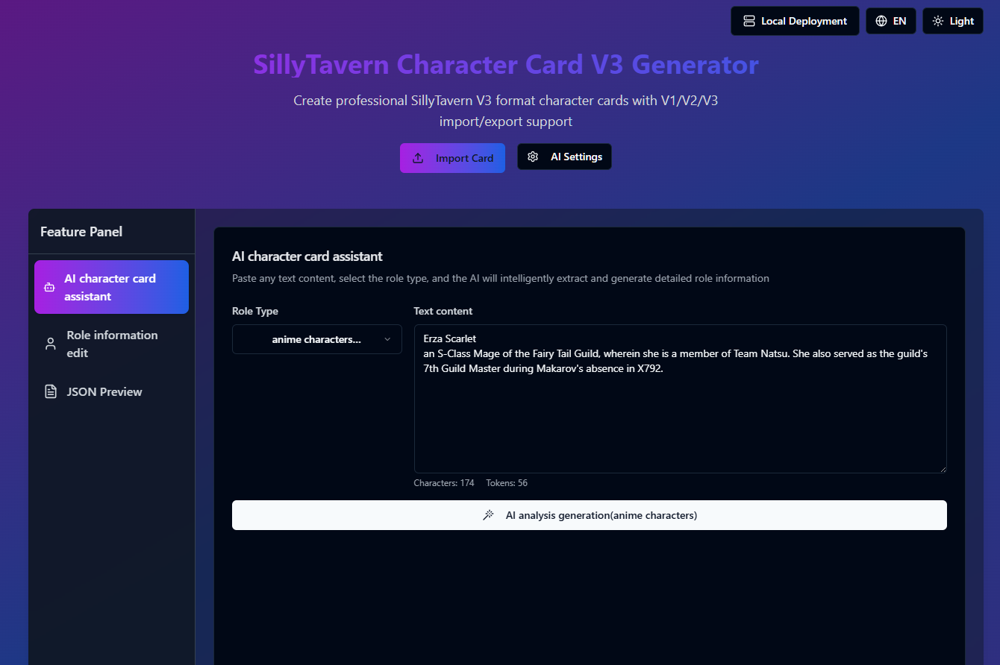
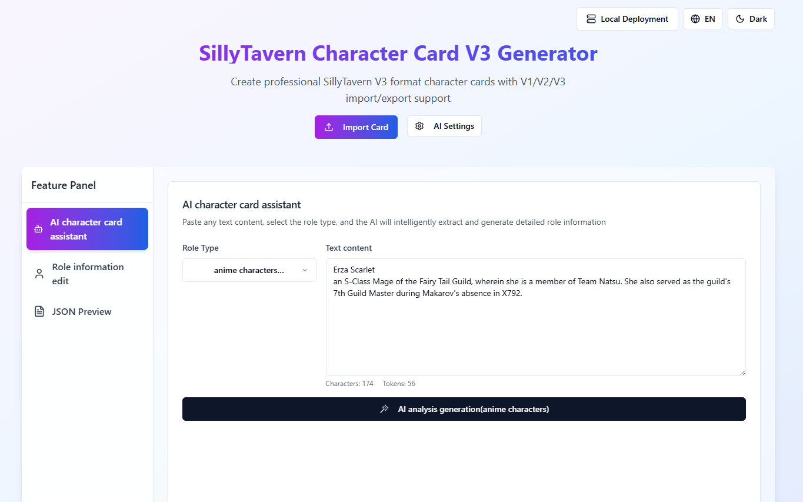
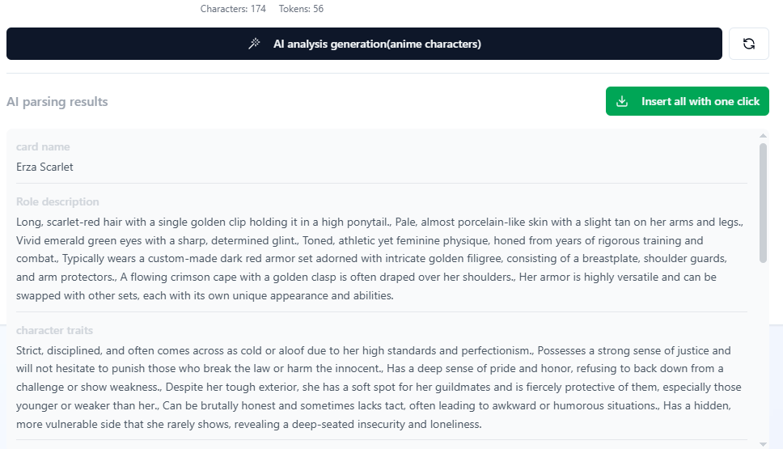
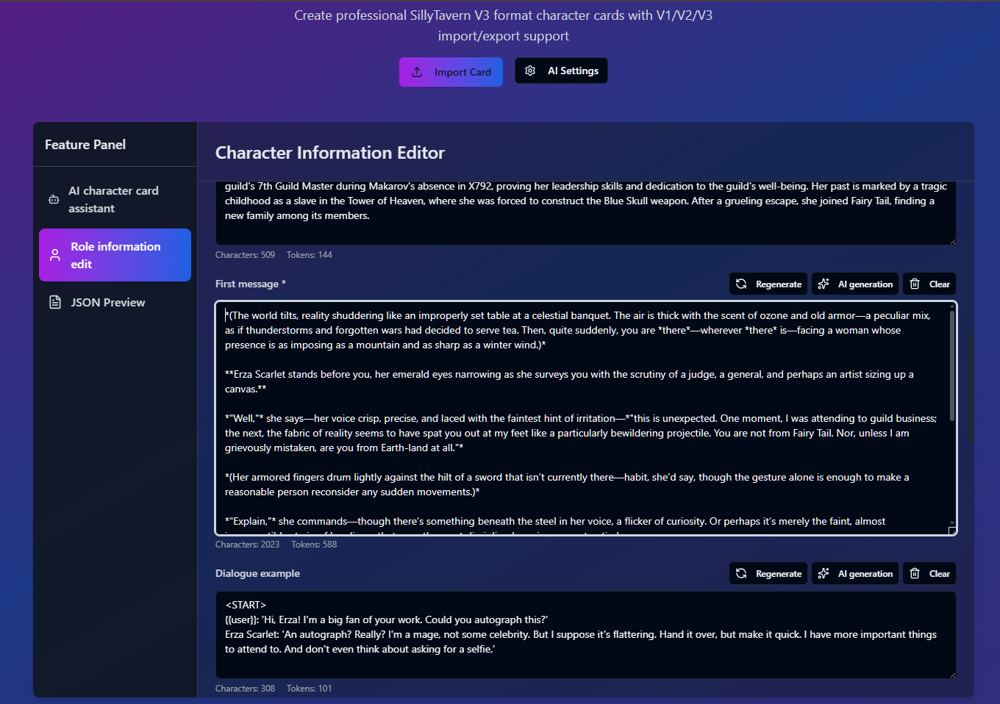
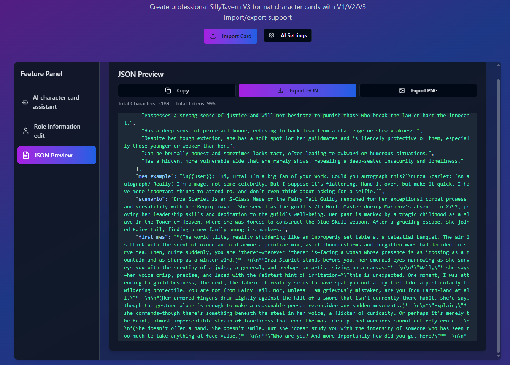

# Tavern Card Crafter - AI character card maker

---

### Project Introduction

Tavern Card Crafter is a professional AI character card maker that helps users easily create and edit character cards for chatbots and roleplay. The tool offers an intuitive interface and powerful features for generating, editing, previewing, and exporting character role cards suitable for chatbot or roleplaying use.




### Key features

#### 🤖 AI intelligent assistant

- **Intelligent Character Creation**: Quickly generate structured character information from free text using AI.
- **Multi-genre support**: Supports character types such as anime, games, novels, historical figures, and more.
- **Intelligent Content Extraction**: Paste any text (novel excerpt, script, notes), and AI will extract and convert it into structured character fields.



#### ✏️ Full character editing

- **Basic information**: Name, description, avatar, first-person perspective, and more.
- **Personality Traits**: Detailed personality traits and behavior patterns for robust role simulation.
- **Scenario Settings**: Backstory, environment, and other scenario-specific settings.
- **Dialogue System**: Compose sample dialogues, greetings, and alternative greetings.
- **Character/Lore Book**: Add and manage worldbuilding or memory entries.
- **Keyword/Tag Classification**: Role labeling and metadata management for easy categorization.

#### 🧩 Prompt Management (new)

- **Editable prompt templates**: Manage and edit prompt templates used across AI generation flows.
- **Prompt interpolation utilities**: Reusable utilities for prompt variable interpolation and templating.
- **PromptEditor UI**: A small UI to create, edit, preview, and select prompt templates while generating.
- **Default and user prompts**: Comes with default templates and lets users create custom templates.

#### 💾 Persisted prompts and cross-environment support

- **Prompt persistence**: User-created or edited prompts are persisted across sessions.
  - On Desktop (packaged Electron releases) prompts are saved/persisted via Electron IPC to local files for full functionality and stable permission handling.
  - On Web, prompts are saved to browser localStorage (useful for quick testing and web-hosted usage).
- **Load / Save / Reset**: Prompts can be loaded, saved, or reset to defaults from the AI Settings dialog.

Note: To get the full functionality and most reliable prompt-saving behavior (especially filesystem persistence and permission handling), the preferred usage method is to download and install the packaged desktop release from this repository's Releases page. Running from source in development mode works, but packaged releases provide the complete persistent storage integration.

#### ⚙️ AI Settings improvements

- **Tabbed AI Settings dialog**: Connection parameters (keys, endpoints) are separated from prompt template management in a tabbed layout for clarity.
- **Connection & generation controls**: Configure model/host settings, temperature, tokens and a dedicated `infTemp` for inference sampling behavior.
- **Clearer error messaging**: Better messages for missing local models and prompt save failures, including permission guidance.

#### 📟 Multi-platform support

- **Web version**: Browser direct access and use (Vite-based).
- **Desktop App**: Cross-platform Electron desktop app with filesystem access.
- **Sidebar Layout**: AI assistant, character editing, and JSON preview split tab interface.

#### 🛠 Practical features

- **Real-time preview**: JSON preview updates in real time with syntax highlighting.
- **Multi-format export**: Export cards as JSON and PNG formats (PNG export embeds the character card into an image; avatar upload required).
- **Language & localization**: The UI is now primarily English by default; Chinese (简体中文) remains available as a toggleable option at the top of the page.
- **Responsive Design**: Layout works across a range of screen sizes and platforms.



---

### Technology Stack

This project uses modern web and desktop technologies:

- React - User Interface Framework
- TypeScript - Type-safe JavaScript
- Vite - Fast build/development tooling
- Electron - Cross-platform desktop application wrapper
- Tailwind CSS - Utility-first CSS framework
- shadcn/ui - Component primitives and patterns
 
---

### User Guide

#### 🚀 Start quickly

1. Start the application via `npm run electron-dev` (development) or download the portable executable from Releases (production).
2. Use the left sidebar to switch between three main modes: AI Assistant, Editor, and JSON/Export Preview.

#### 📋 Detailed explanation of functions

##### 🤖 AI character card assistant

1. Paste a character-related text into the input box (novel snippets, game description, notes).
2. Select the character type (anime, games, novels, historical figures, etc.).
3. Click "AI Analysis / Generation" — AI will extract structured character fields.
4. Click generated fields to fill them into the Role Editor with one click.

##### 🧾 Prompt templates and AI Settings

1. Open AI Settings and switch to the "Prompts" tab.
2. Create or edit prompt templates in the PromptEditor UI.
3. Save templates — saved prompts persist across sessions (Electron packaged releases: filesystem via IPC; Web: localStorage).
4. Use the "Connection" tab in AI Settings to configure model endpoint, credentials, temperature, max tokens, and `infTemp`.

##### ✏️ Character information editing

1. Edit basic fields (name, description, avatar).
2. Fill in personality, behavior patterns, and special scenario notes.
3. Configure dialogue — first message, examples, and alternative greetings.
4. Add worldview/memory book entries and use tags to classify characters.

##### 📄 JSON Preview

1. Real-time JSON preview of the generated character card.
2. Syntax highlighting and escaped JSON content to prevent XSS vectors.
3. Statistics: shows total characters and token estimation for the current card.
4. Export options:
   - JSON Export: download a standard JSON file.
   - PNG Export: export an image of the character card (requires avatar upload).
   - Copy to clipboard: quickly copy JSON content.

#### 💡 Usage Tips

- Use the AI Assistant to quickly bootstrap a card, then refine in the editor.
- Create reusable prompts for specific genres/tones in the PromptEditor to get consistent results.
- The UI synchronizes data across the AI assistant, editor, and preview tabs in real time.
- For the most reliable prompt persistence and fewer permission issues, download and install the packaged desktop release from Releases.

---

### For Development: Get started quickly

#### Environmental Requirements

Make sure your system has:

- Node.js (use nvm if you want to manage Node versions)
- npm (or a compatible package manager)

(If you have strict constraints, use the versions preferred in your development environment; Electron and dependencies generally work with Node LTS releases.)

#### Install and run

```bash
# 1. Clone project
git clone <YOUR_GIT_URL>

# 2. Enter the project directory
cd tavern-card-crafter-v3

# 3. Install dependencies
npm install

# 4. Start the development server (Web version)
npm run dev

# Or start desktop application development mode
npm run electron-dev
```

- Web version: open `http://localhost:8080` (or the port Vite reports) in your browser
- Desktop (dev): running `npm run electron-dev` will open an Electron development window
- Desktop (full prompt persistence): for the most complete prompt-saving experience use the latest packaged desktop release from Releases

#### Build and run

##### Web Version

```bash
# Build a web version
npm run build

# Preview build results
npm run preview
```

---

### Project structure

Note: The project file structure has undergone significant changes to support prompt management, prompt persistence, localized UI, and modular AI integration. The tree below is a representative layout; consult the repository for the canonical structure.

```
src/
├── components/
│   ├── CharacterForm/
│   │   ├── AIAssistant.tsx
│   │   ├── AlternateGreetings.tsx
│   │   ├── BasicInfoSection.tsx
│   │   ├── CharacterBook.tsx
│   │   ├── MetadataSection.tsx
│   │   ├── PersonalitySection.tsx
│   │   ├── PromptsSection.tsx
│   │   └── TagsSection.tsx
│   ├── AISettings.tsx
│   ├── CharacterPreview.tsx
│   ├── PromptEditor.tsx
│   ├── Toolbar.tsx
│   └── ui/
├── config/          
│   ├──  defaultPrompts.json
│   └── ui/
├── contents/
│   ├── LanguageContent.tsx
│   └── ThemeContent.tsx
├── hooks/
│   ├── generatorHook.ts
│   ├── use-toast.ts
│   └── use-mobile.tsx
├── lib/
│   └── utils.ts
├── pages/
│   └── Index.tsx
├── utils/
│   ├── aiGenerator.ts
│   ├── buildApiUrl.ts
│   ├── promptManager.ts
│   ├── promptMigration.ts
├── types/
│   └── prompts.ts
└── electron/
    ├── main.cjs
    ├── preload.js
```

## Contribution Guide

Welcome — issues and pull requests are appreciated! If you add providers or functionality, please include tests or a short migration note. Sharing of prompts is also welcome.

### License

This project is licensed under the MIT license. See the LICENSE file for details.

---

## Changelog

### 1/15/26

#### New Features:

- Add a prompt management system with editable templates, including a PromptEditor UI, default prompt configuration, and prompt interpolation utilities used across AI generation flows.
- Persist user-defined prompts via Electron IPC and local storage, with support for loading, saving, and resetting prompts in both desktop and web environments.
- Extend the AI settings dialog with tabbed navigation separating connection parameters from prompt template management.

#### Bug Fixes:

- Escape JSON content before syntax highlighting in the character preview to prevent XSS vulnerabilities.
- Correct AI temperature handling by using a dedicated infTemp setting instead of overloading the generic temperature field.

#### Enhancements:

- Refine AI settings layout with a wider dialog and clearer organization of connection and generation parameters.
- Centralize AI generation prompt text into reusable templates rather than hardcoded strings, simplifying future changes and localization.
- Add clearer error messaging for missing local models and for prompt save failures, including friendlier permission-denied guidance.
- Document and slightly clean up Electron window-creation logic and character preview documentation comments for better maintainability.

### 1/12/26

- Configurable temperature and max token response accessible via 'AI Settings'

### 10/25

- Translated to English from original repo.
- **Got saving to a PNG file actually working!**
- Only tested with local and openrouter. If you have trouble with another provider, please open an issue.
